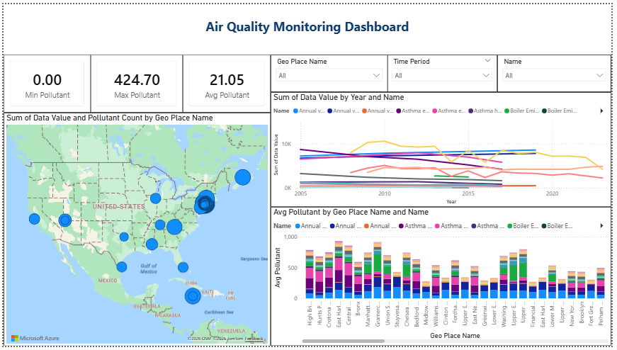

# 🌍 Air Quality Monitoring Dashboard

An interactive **Power BI dashboard** for monitoring, analyzing, and visualizing air pollution data across multiple geographic locations and time periods.

---

# 📌 Project Overview

The **Air Quality Monitoring Dashboard** helps analyze environmental pollution trends using interactive visualizations, maps, KPIs, and filtering options.

This dashboard enables users to:
- Monitor air quality levels
- Compare pollutants across locations
- Analyze yearly pollution trends
- Identify pollution hotspots
- Support environmental and public health analysis

---

# 🖼 Dashboard Screenshot



> Place your dashboard screenshot inside the `Images` folder and rename it as:
>
> `dashboard_preview.png`

---

# 📊 Dashboard Preview

## Main Dashboard Features
- KPI Cards
- Interactive Filters
- Geo Map Visualization
- Trend Analysis Charts
- Pollutant Comparison Charts

---

# 📊 Dataset Information

The dataset contains air quality measurements collected from different geographic regions over multiple time periods.

## Dataset Columns

| Column Name | Description |
|---|---|
| Unique ID | Unique identifier for each record |
| Indicator ID | Pollutant indicator ID |
| Name | Pollutant name |
| Measure | Statistical measure type |
| Measure Info | Measurement unit |
| Geo Type Name | Geographic classification |
| Geo Join ID | Geographic area ID |
| Geo Place Name | Geographic location name |
| Time Period | Reporting period |
| Start_Date | Observation start date |
| Data Value | Pollutant measurement value |
| Message | Additional remarks |

---

# 🌫 Supported Pollutants

- Ozone (O3)
- Nitrogen dioxide (NO2)
- Fine particles (PM 2.5)
- Sulfur dioxide (SO2)
- Carbon monoxide (CO)

---

# 📈 Dashboard Components

## 1️⃣ KPI Cards
Displays:
- Minimum Pollutant Value
- Maximum Pollutant Value
- Average Pollutant Value

---

## 2️⃣ Geo Map Visualization
Interactive map used to:
- Display pollution distribution
- Highlight pollution hotspots
- Compare regions visually

---

## 3️⃣ Pollution Trend Analysis
Line chart showing:
- Pollution trends over years
- Comparison between pollutants
- Seasonal and yearly analysis

---

## 4️⃣ Average Pollution Comparison
Stacked bar chart displaying:
- Average pollutant levels by region
- Pollutant comparison across locations

---

## 5️⃣ Interactive Filters
Users can filter data by:
- Geo Place Name
- Pollutant Name
- Time Period

---

# 📌 Example Dataset Records

| Pollutant | Location | Time Period | Data Value |
|---|---|---|---|
| Ozone (O3) | West Queens | Summer 2023 | 34.36 |
| Nitrogen dioxide (NO2) | Greenpoint | Summer 2022 | 14.07 |
| Fine particles (PM 2.5) | Chelsea-Village | Annual Average 2023 | 8.02 |

---

# ⚙️ Data Processing Workflow

## Step 1: Data Import
Data imported from:
- Excel
- CSV
- SQL Database

## Step 2: Data Cleaning
Performed using Power Query:
- Remove null values
- Format date columns
- Standardize pollutant names

## Step 3: Data Modeling
Relationships created between:
- Date tables
- Geography tables
- Pollution indicators

## Step 4: DAX Measures

### Average Pollutant
```DAX
Avg Pollutant = AVERAGE('AirQuality'[Data Value])
```

### Maximum Pollutant
```DAX
Max Pollutant = MAX('AirQuality'[Data Value])
```

### Minimum Pollutant
```DAX
Min Pollutant = MIN('AirQuality'[Data Value])
```

---

# 🛠 Technologies Used

| Tool | Purpose |
|---|---|
| Power BI | Dashboard Development |
| Power Query | Data Transformation |
| DAX | Data Calculations |
| Bing/Azure Maps | Geo Visualization |

---

# 📌 Key Insights

The dashboard helps answer:
- Which regions have the highest pollution?
- Which pollutants are most dominant?
- How pollution changes over time?
- Which locations require environmental attention?

---

# 💼 Business Use Cases

- Environmental Monitoring
- Public Health Analysis
- Government Reporting
- Smart City Analytics
- Climate Research

---

# 🚀 Future Enhancements

Possible improvements:
- Real-time IoT sensor integration
- AI-based pollution forecasting
- Automated alerts system
- Mobile dashboard optimization

---

# ▶️ How to Use

1. Open the Power BI dashboard
2. Select filters:
   - Pollutant
   - Region
   - Time period
3. Analyze charts and maps
4. Explore pollution trends

---

# 📂 Project Structure

```bash
Air-Quality-Monitoring-Dashboard/
│
├── Dataset/
│   └── air_quality_data.csv
│
├── Dashboard/
│   └── AirQualityDashboard.pbix
│
├── Images/
│   └── dashboard_preview.png
│
├── README.md
│
└── Reports/
```

---

# 👨‍💻 Author

## Champ
Power BI & Data Analytics Project

---

# 📄 License

This project is created for:
- Educational Purposes
- Environmental Analysis
- Data Visualization Practice

---
